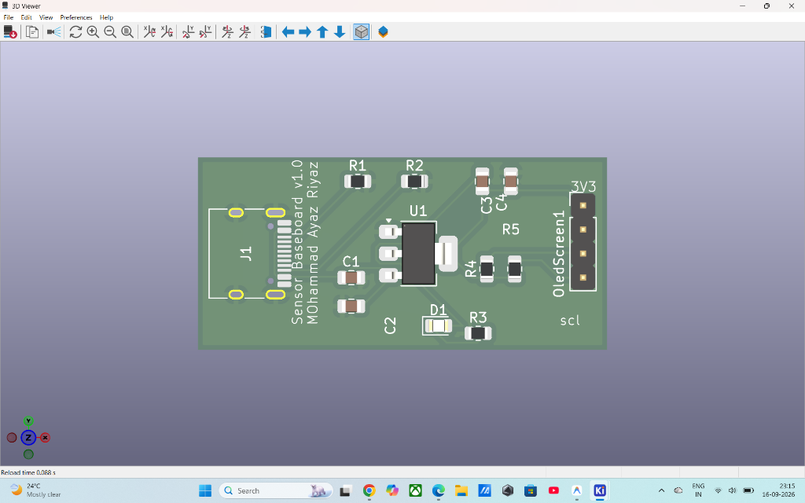
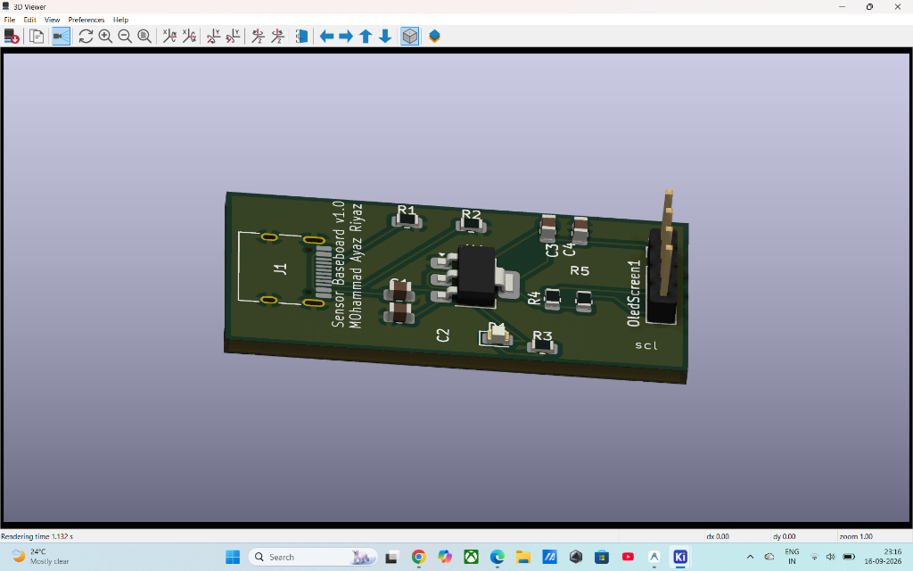

# Sensor Power & I2C Baseboard (v1.0)

A modular, production-ready power delivery and sensor breakout PCB designed in KiCad 10.

Designed by **Mohammad Ayaz Riyaz** (2nd Year ENTC @ PVGCOET Pune).

---

## 📸 3D Hardware Renders

| Top-Down View | Perspective 3D View |
| :---: | :---: |
|  |  |

---

## ⚡ Circuit & Layout Specifications

### 1. USB-C 5V Power Sink
- **Connector:** 16-Pin USB-C Receptacle (`USB_C_Receptacle_HRO_TYPE-C-31-M-12`).
- **Negotiation:** Dual $5.1\text{ k}\Omega$ pull-down resistors ($R_1, R_2$) on CC1 and CC2.
  - *Engineering Rationale:* Ensures modern USB Type-C power supplies / PD chargers recognize the board as a valid power sink and turn on the 5V rail.
- **Orientation:** Outward-facing connector on the left board edge allowing standard cable clearance.

### 2. Voltage Regulation (5V $\rightarrow$ 3.3V)
- **LDO Regulator:** `AMS1117-3.3` (SOT-223 package with ground heatsink tab).
- **Filtering & Decoupling:**
  - **Input:** $10\,\mu\text{F}$ bulk capacitor ($C_1$) + $100\text{ nF}$ high-frequency bypass capacitor ($C_2$) placed right at $V_{in}$ to attenuate input transients.
  - **Output:** $22\,\mu\text{F}$ capacitor ($C_3$) + $100\text{ nF}$ bypass capacitor ($C_4$) for regulator feedback loop stability.
- **Power Indicator:** Status LED ($D_1$) with a $1\text{ k}\Omega$ series current-limiting resistor ($R_3$).

### 3. I2C Sensor Interface Header
- **Pinout:** 4-pin $2.54\text{ mm}$ pitch male header (`3V3`, `GND`, `SDA`, `SCL`) compatible with OLED displays (SSD1306), environmental sensors (BME280), and IMUs (MPU6050).
- **Pull-Ups:** Dedicated $4.7\text{ k}\Omega$ pull-up resistors ($R_4, R_5$) on SDA and SCL to guarantee sharp clock and data rise times on open-drain signals.

---

## 🛠️ PCB Manufacturing Specifications

| Parameter | Specification |
| :--- | :--- |
| **Dimensions** | Approx. $40\text{ mm} \times 20\text{ mm}$ |
| **Layer Count** | 2 Layers (`F.Cu` signals/power, `B.Cu` solid ground plane) |
| **PCB Thickness** | $1.6\text{ mm}$ |
| **Surface Finish** | HASL with lead / Lead-Free HASL / ENIG |
| **Solder Mask** | Matte Green |
| **Silkscreen** | White |
| **Design Rules** | Checked & passed with **0 DRC Errors** & **0 Unconnected Nets** |

---

## 📦 Manufacturing & Design Files
- **KiCad Schematic Source:** `Sensor_Power_Baseboard.kicad_sch`
- **KiCad PCB Layout:** `Sensor_Power_Baseboard.kicad_pcb`
- **Schematic PDF:** [Sensor_Power_Baseboard.pdf](./Sensor_Power_Baseboard.pdf)
- **Production Gerbers & Drill ZIP:** [Sensor_Power_Baseboard_Gerbers.zip](./production/Sensor_Power_Baseboard_Gerbers.zip) *(Ready to upload to JLCPCB, PCBWay, or LionCircuits)*
